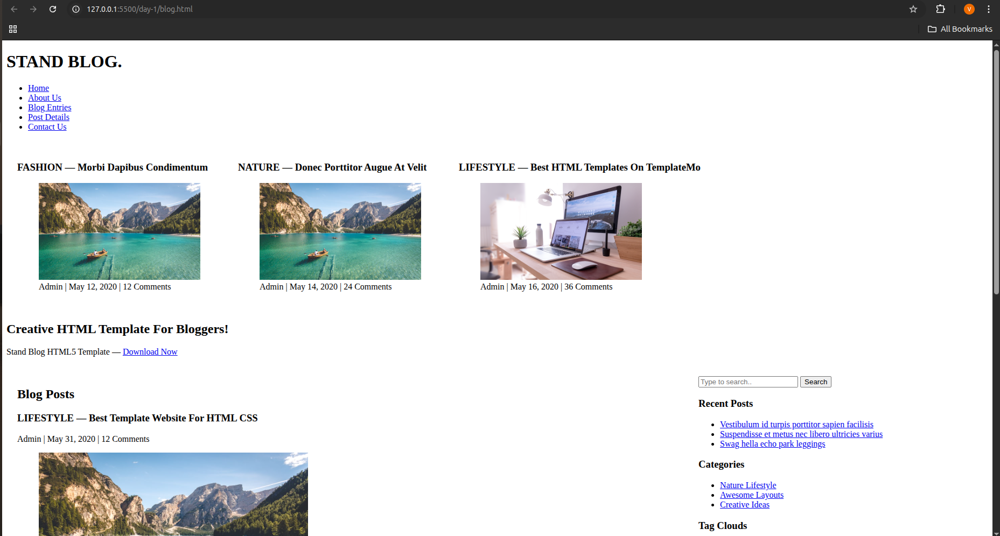
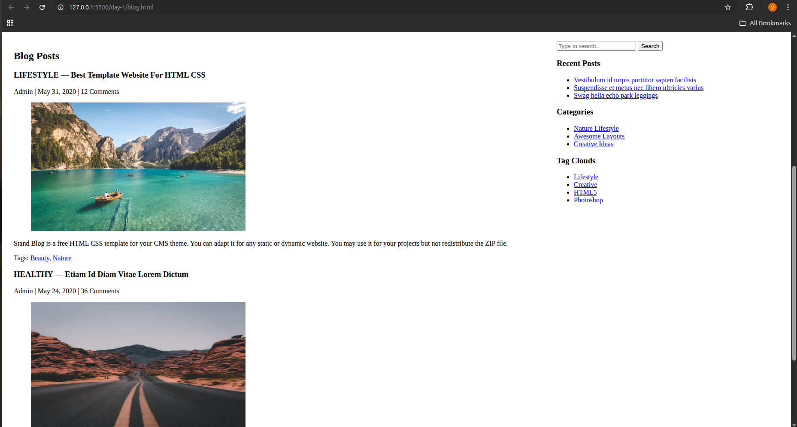
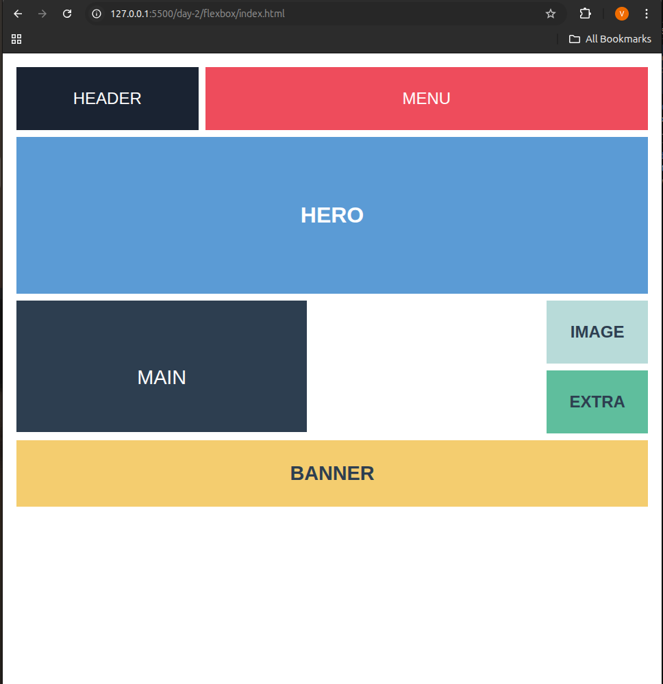
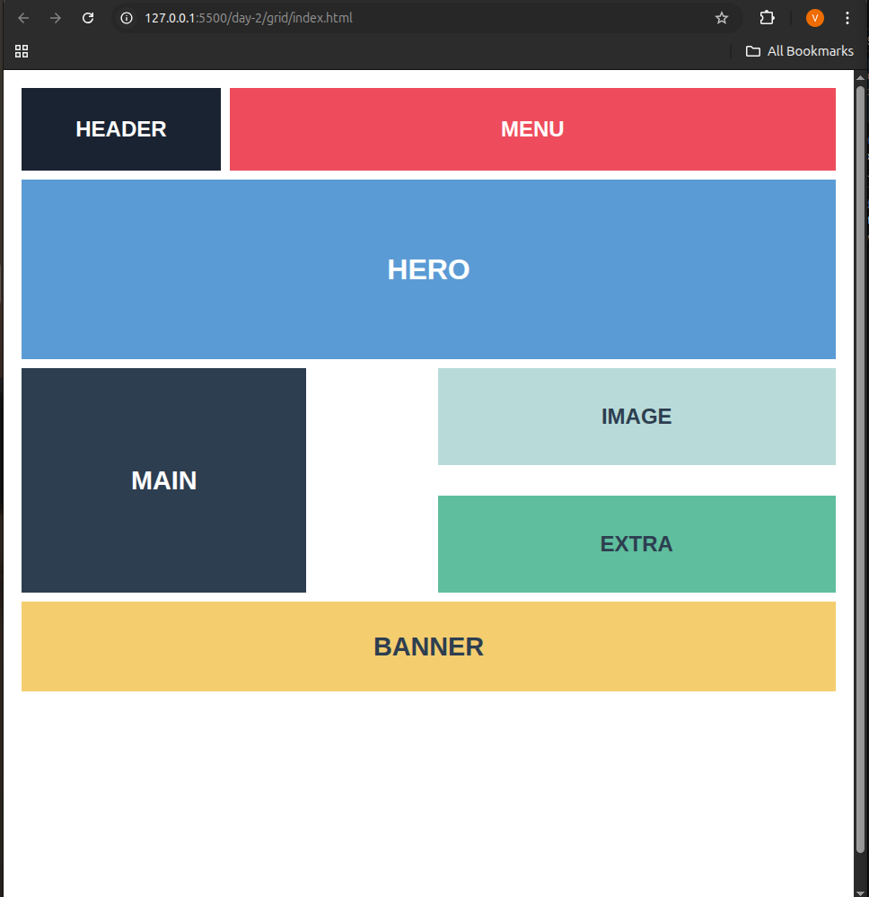
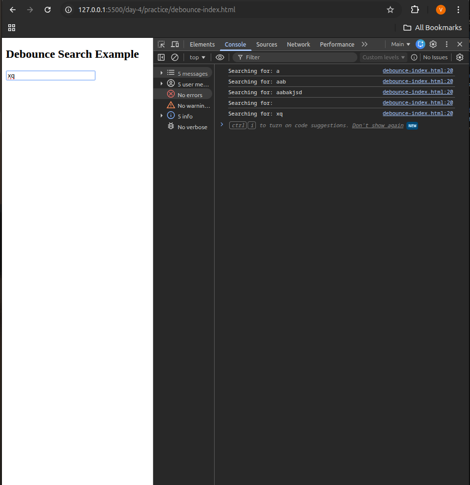
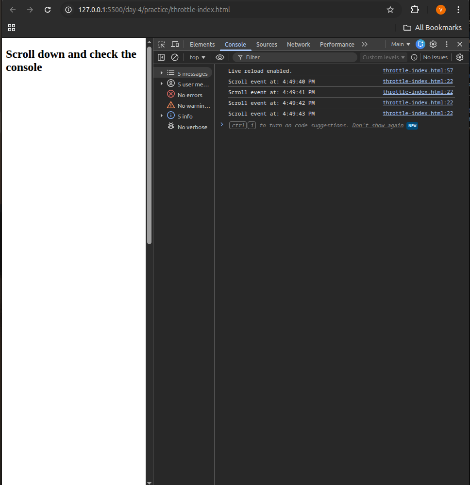
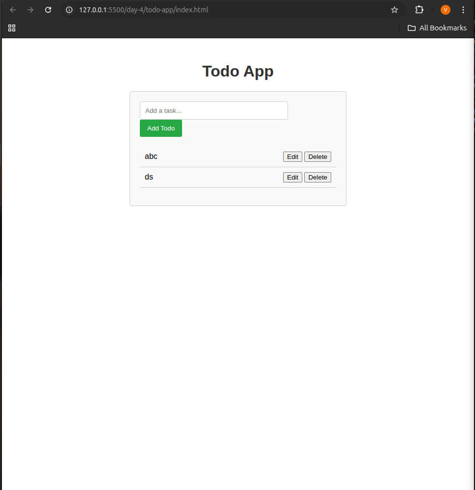
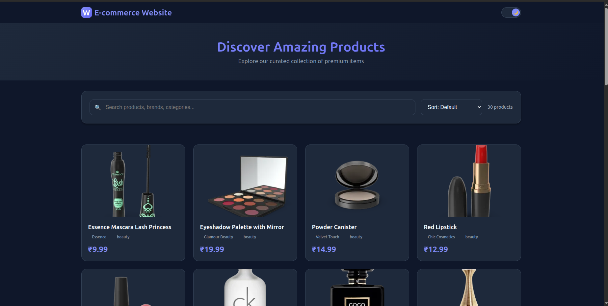

````markdown
# 📚 Full Learning Portfolio – HTML5, CSS3, JavaScript (Day 1 to Day 5)

This repository contains **all projects and practice files from Day 1 to Day 5**, covering **Semantic HTML5**, **Responsive CSS (Flexbox & Grid)**, **JavaScript ES6**, **DOM Manipulation**, **Utilities**, and **LocalStorage-based Mini Projects**.

It is a complete structured learning showcase documenting your progress.

---

# 🧩 Table of Contents
1. [Day 1 – Semantic HTML5 Blog Project](#day-1--semantic-html5-blog-project)
2. [Day 2 – CSS Selectors + Responsive Flexbox & Grid](#day-2--css-selectors--responsive-flexbox--grid)
3. [Day 3 – JavaScript ES6 + DOM Manipulation](#day-3--javascript-es6--dom-manipulation)
4. [Day 4 – JS Utilities + LocalStorage Mini Project](#day-4--js-utilities--localstorage-mini-project)
5. [Day 5 – (Screenshots + Summary)](#day-5--screenshots--summary)

---

# 📰 Day 1 – Semantic HTML5 Blog Project

## 📘 Overview
A complete **semantic HTML5 blog layout** created **without any `<div>` or CSS**.  
This project focuses purely on **HTML5 structure, accessibility, ARIA roles**, and semantic readability.

---

## 🧱 Project Structure

| Section         | Description |
|-----------------|-------------|
| `<header>`      | Page title + navbar |
| `<section>`     | Featured posts, banners |
| `<article>`     | Blog posts |
| `<main>`        | Table-based page layout |
| `<aside>`       | Sidebar content |
| `<footer>`      | Social links + copyright |

---

## 🧩 Semantic HTML5 Tags Used

- Structural: `header`, `main`, `section`, `article`, `aside`, `footer`, `nav`
- Media: `figure`, `figcaption`, `img`
- Text: `h1`–`h3`, `p`, `time`, `small`, `a`
- Forms: `input type="search"`, `button`

---

## ♿ Accessibility Features

- `role="banner"`, `role="navigation"`, `role="main"` etc.
- ARIA labels for improved screen reader support
- Meaningful `alt` text on images
- Native tab navigation

---

## 🧩 Learning Outcomes

- Proper structure using semantic HTML5
- Creating layouts without CSS
- Using ARIA roles for accessibility
- Enhancing readability and SEO through semantic HTML

---

## 🖼️ Screenshots




---

# 🎨 Day 2 – CSS Selectors, Flexbox & Grid Responsive Layout

## 📘 Overview
Created **two responsive layouts**, one using **Flexbox** and another using **CSS Grid**, focusing on:
- Selectors & Specificity  
- Responsive design  
- Mobile-first approach  

---

## 🧱 Key Activities

### 1. CSS Selectors
- Class, ID, attribute, pseudo-class, descendant selectors
- Understanding specificity and cascade

### 2. Flexbox Layout
- Navbar + hero section
- Content + sidebar alignment
- `flex-wrap`, `justify-content`, `align-items`
- Responsive stacking using media queries

### 3. Grid Layout
```css
grid-template-columns: repeat(auto-fit, minmax(250px, 1fr));
````

### 4. Responsive Breakpoints

| Screen Width | Layout            |
| ------------ | ----------------- |
| > 1024px     | Multi-column grid |
| 768–1024px   | Reduced columns   |
| < 768px      | Single column     |

---

## 🖼️ Screenshots

### Flexbox


### Grid


---

## 🧰 Technologies Used

* HTML5
* CSS3 (Flexbox, Grid, Media Queries)
* VS Code + Live Server

---

# 🧠 Day 3 – JavaScript ES6 + DOM Manipulation

## 🔹 Learning Outcomes

* Modern JavaScript (`let`, `const`, arrow functions)
* Array methods (`map`, `filter`, `reduce`)
* DOM manipulation (navbar toggle, dropdown, modal)
* Event listeners (click + keyboard)
* Built a **FAQ Accordion** using JS

---

## 🧩 Activities

| Feature               | Description               |
| --------------------- | ------------------------- |
| Variables & Functions | ES6 syntax                |
| Arrays/Objects        | `map`, `filter`, `reduce` |
| DOM Manipulation      | Toggle UI components      |
| Events                | Click + key listeners     |
| Mini Project          | FAQ Accordion             |

---

## 🧪 FAQ Accordion Project

### Features:

* Smooth open/close animation
* Only one active accordion at a time
* Vanilla JS

### Reference:


---

## Files:

```
index.html
style.css
script.js
README.md
```

---

# 🧩 Day 4 – JS Utilities + LocalStorage Mini Project

## 🔹 Learning Outcomes

* Implement `debounce`, `throttle`, `groupBy`
* Learn performance optimization
* Use LocalStorage to persist data
* Error handling with `try/catch`
* Build a persistent **Todo App**

---

## 📑 Folder Structure

```
/todo-app/
│
├── index.html
├── style.css
├── script.js
├── debounce.html
├── throttle.html
└── README.md
```

---

## ⚙️ 1. Debounce Function

```js
function debounce(fn, delay) {
  let timer;
  return function(...args) {
    clearTimeout(timer);
    timer = setTimeout(() => fn.apply(this, args), delay);
  };
}
```

Screenshot:


---

## ⚡ 2. Throttle Function

```js
function throttle(fn, limit) {
  let inThrottle = false;
  return function(...args) {
    if (!inThrottle) {
      fn.apply(this, args);
      inThrottle = true;
      setTimeout(() => inThrottle = false, limit);
    }
  };
}
```

Screenshot:

---

## 📝 3. Todo App (CRUD + LocalStorage)

### Core Logic

```js
function saveTodos(todos) {
  localStorage.setItem('todos', JSON.stringify(todos));
}

function getTodos() {
  return JSON.parse(localStorage.getItem('todos')) || [];
}
```

### Features

* Add / Edit / Delete todos
* Persistent LocalStorage
* Error handling
* Clean UI

Screenshot:

---

## 🧱 Error Handling Example

```js
try {
  renderTodos();
} catch (err) {
  console.error('Render error:', err);
}
```

---

# 📅 Day 5 – Screenshots + Summary



---

This repository showcases your structured journey through:

* Semantic HTML5
* Responsive CSS3 (Flexbox + Grid)
* Modern JavaScript ES6
* DOM Interactions
* Performance Utilities
* LocalStorage-based persistent apps

---
